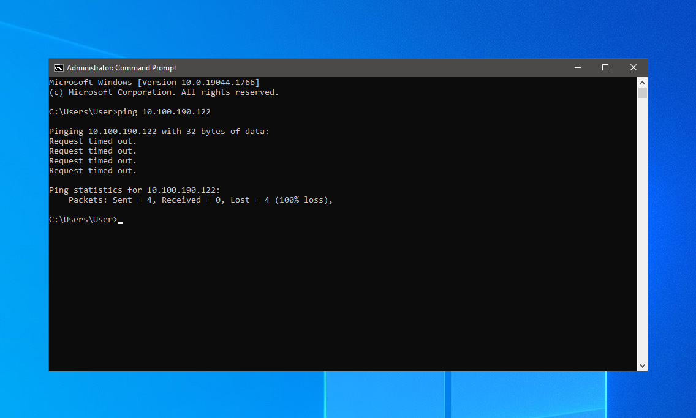
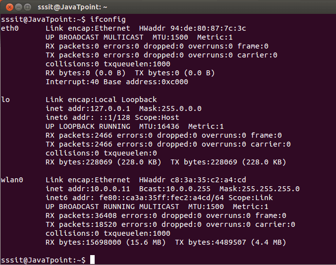
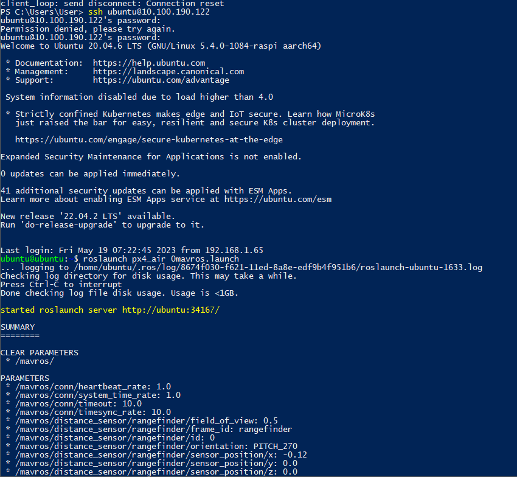

# Подготовка к работе
Для работы с дроном необходимо чтобы и дрон и наземная станция (ПК) находились в одной сети Интернет. (Сейчас работа настроена на сеть "PAMC"). Так же необходимо знать IP адрес Raspberry Pi в этой сети (сейчас это 10.100.190.122).
Проверить адрес можно с помощью команды `ping <адрес Raspberry Pi>` в командно строке Windows.(Чтобы ее открыть нужно ввести в поиске Windows `cmd`).

Если результат работы команды такой:



значит указанный адрес не правильный и нужно выяснить настоящий адрес. Для этого необходимо соединить Raspberry Pi с компьютером шнуром USB-C/USB, подключить дисплей через кабель HDMI и клавиатуру. При подключении USB кабеля к плате, происходит запуск Ubuntu который может занять некоторое время.
После запуска предлагается войти в учетную запись и ввести пароль(пароль: `123456`).

После этого можно открыть терминал Ubuntu (комбинация клавиш `Ctrl + Alt + T`). В него нужно написать комманду:
```
ifconfig
```

В строке wlan0 находим правильный адрес.




# Включение квадрокотера

Перед включением убедится что полетный контроллер подключен к Raspberry Pi.
Подключить батарею к разъему питания. Убедиться что на плате Raspberr Pi загорелись светодиоды (Красный отвечает за питания, зеленый показывает работу SD карты памяти).
Через какое-то время можно подключаться к дрону по `ssh`. Для этого необходимо на Пк запустить Windows PowerShell и в нем прописать комманду подключения:

```
ssh ubuntu@<IP адрес Raspberry Pi>
```
При первом подключении вас попросят дать согласие на подключение. Для этого нужно просто написать `yes` в окно Windows PowerShell.
Полсе этого нужно ввести пароль от системы (пароль: `123456`) и дождаться ее загрузки.



После этого можно ввести комманду: 
```
roslaunch px4_air 0mavros.launch
```

и дождаться ее полного выполнения (Можно запустить QGround Control и ждать автоматического подключений квадрокоптера к нему). Как только это произойдет дрон готов к запуску, нужно только включить пульт (Перед полетом ознакомьтесь какие каналы пульта отвечают за смену режима полета, а какие запускают/армят дрон). 

# Настройка полетного контроллера 

Для настройки полетного контроллера нужно отключить батарею и Raspberry Pi от дрона и подключить полетный контроллер к ПК через USB кабель. После этого можно запустить QGround Control и вы получите доступ ко всем  настройкам квадрокоптера.


